# Masjid PWA

A high-performance, premium Progressive Web Application (PWA) designed to serve as a digital hub for any Masjid. It combines a modern UI/UX with essential Islamic features, providing a seamless experience across mobile, tablet, and desktop devices.

## 📸 Screenshots

### Main Views (Mobile & Desktop)

| Mobile View | Desktop View |
| :---: | :---: |
| 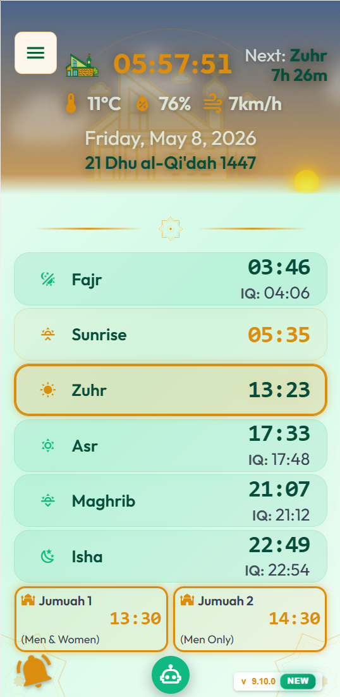 | 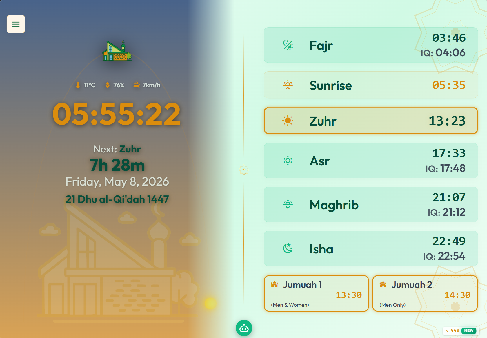 |

<details>
<summary>🔍 Click to view more screenshots</summary>

### App Modules & Features

| About | Azkar | Contact |
| :---: | :---: | :---: |
| 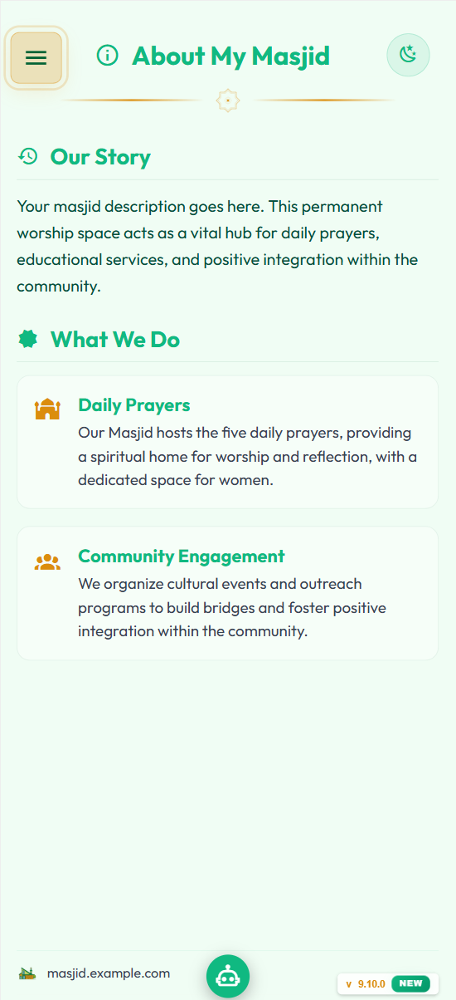 | 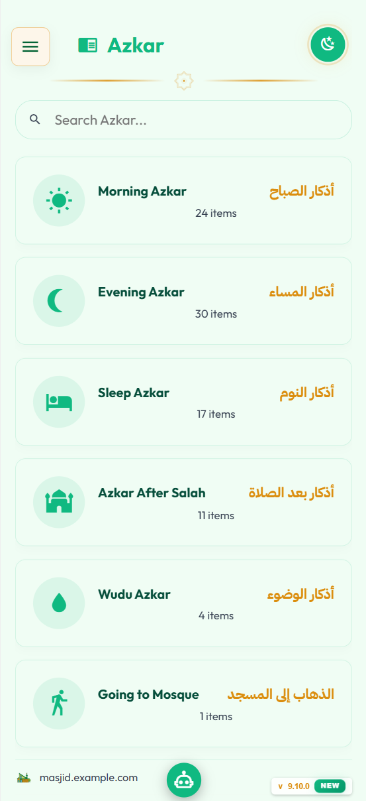 | 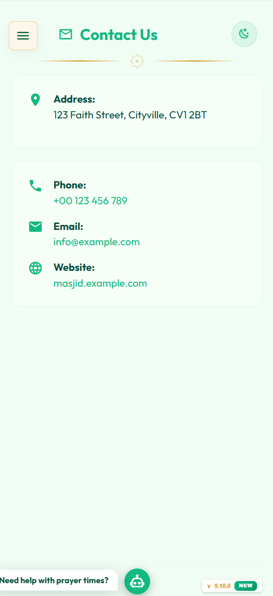 |

| Donate | Quran Reader | Yearly Prayers |
| :---: | :---: | :---: |
| 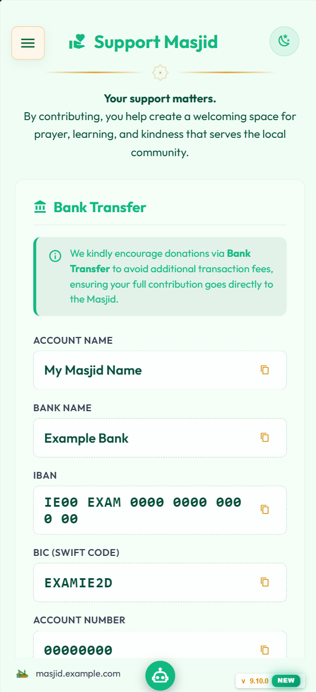 | 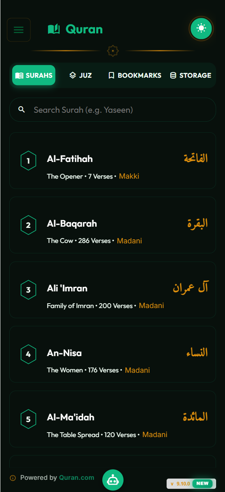 | 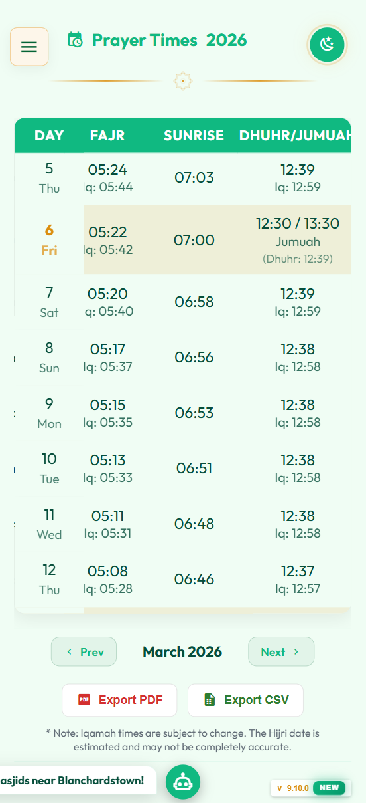 |

| Qiblah Finder | Radio | Tasbih |
| :---: | :---: | :---: |
| 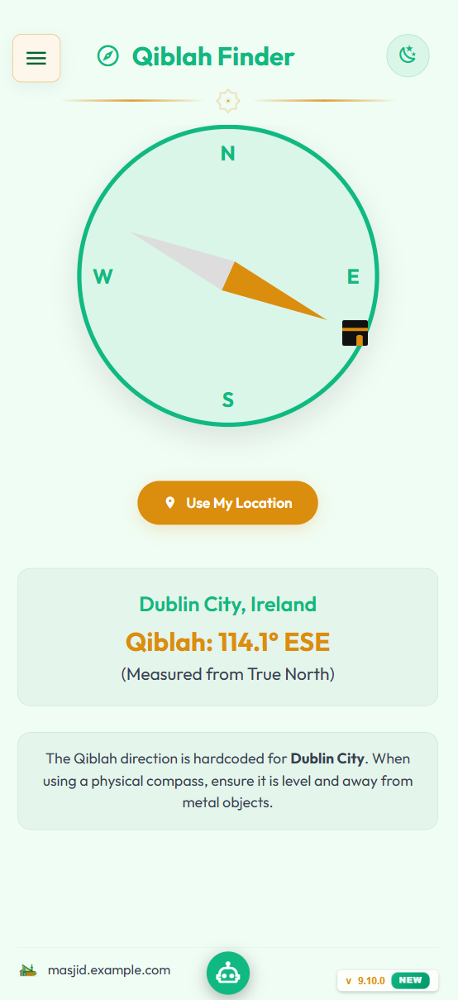 | 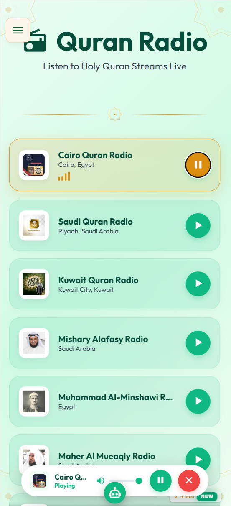 | 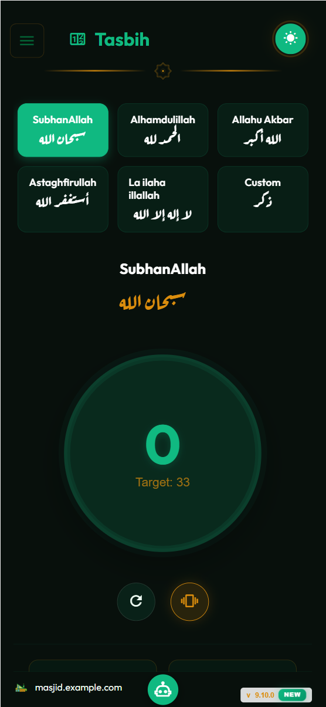 |

| Settings (General) | Settings (Display) | |
| :---: | :---: | :---: |
| 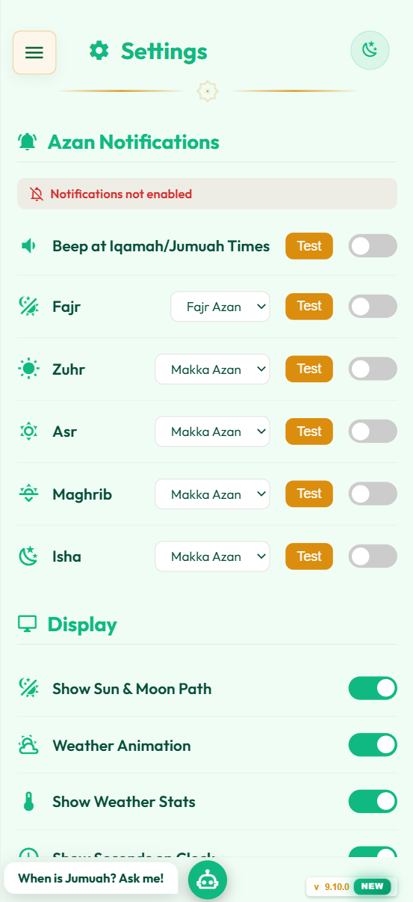 | 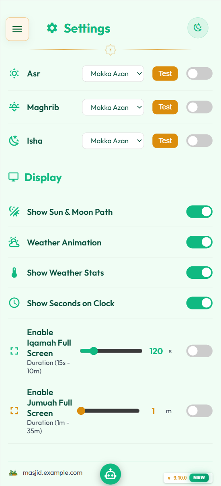 | |

</details>

---

## ✨ Features

- 🕋 **Dynamic Prayer Times**: Real-time Adhan and Iqamah tracking with automated countdowns and congregation alerts.
- 📅 **Interactive Timetables**: Full yearly prayer schedules with support for multiple Jumuah shifts and automatic seasonal adjustments.
- 📖 **Digital Quran**: A full-featured Quran reader with multi-language translations and high-quality audio recitations.
- 📻 **Quran Radio**: 24/7 streaming Quran radio service integrated directly into the sidebar.
- 🧭 **Qiblah Finder**: A real-time, browser-based Qiblah compass for accurate prayer direction.
- 📍 **Nearby Masjids**: Interactive map to help community members find local prayer spaces and services.
- 📢 **Smart Notifications**: Overlay system for urgent announcements, events, and community news.
- 🤖 **AI Chatbot**: A contextualized AI assistant capable of answering questions about the Masjid, prayer times, and basic Islamic knowledge.
- 🌓 **Celestial Tracking**: Dynamic sun and moon positioning based on the Masjid's specific GPS coordinates.
- 🌤️ **Weather Forecast**: Real-time local weather updates and forecasts powered by the Masjid's geolocation.
- 📱 **PWA Ready**: Fully installable as an app on iOS, Android, and Desktop with offline caching capabilities.

---

## 🛠️ Customization

The application is designed to be "agnostic," meaning all masjid-specific data is centralized in configuration files. The easiest way to produce a customized package is by using the provided **PWA Builder**.

### Using the PWA Builder

The builder provides a user-friendly web interface to customize your PWA without touching the code.

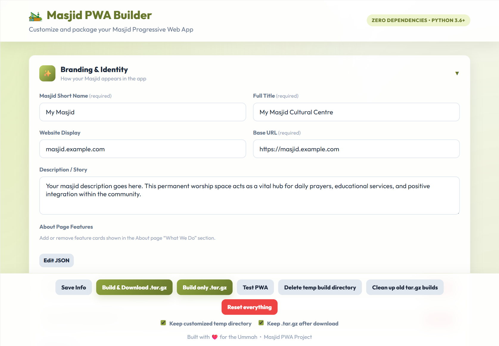

1. Navigate to the tools directory:
   ```bash
   cd pwa-guide-and-tools
   ```

2. Start the builder portal:
   ```bash
   python3 pwa-builder.py
   ```

3. Open the provided URL (usually `http://localhost:8080`) in your browser.
4. Fill in your Masjid's details, upload logos, and configure features.
5. Save your state and build the customized package.

For more advanced usage and CLI commands, refer to the README in the [pwa-guide-and-tools](pwa-guide-and-tools/) directory.

---

## 🚀 Running Locally

To run the web application locally for testing:

1. Navigate to the web app directory:
   ```bash
   cd masjid-web-app
   ```
2. Serve the directory using a local web server (e.g., Live Server in VS Code, or Python's HTTP server):
   ```bash
   python3 -m http.server 9000
   ```
3. Open `http://localhost:9000` in your browser.

---

## 🎗️ Credits & Attributions

Special thanks to the following open-source projects and services that make this app possible:

- **[Quran.com](https://quran.com/)**: For providing the excellent API used for the Digital Quran and translations.
- **[jsPDF](https://github.com/parallax/jsPDF)**: For the core PDF generation capabilities.
- **[jspdf-autotable](https://github.com/simonbengtsson/jspdf-autotable)**: For the jsPDF plugin used to generate schedule tables.

---

## 📄 License

This project is licensed under the MIT License - see the [LICENSE](LICENSE) file for details.
